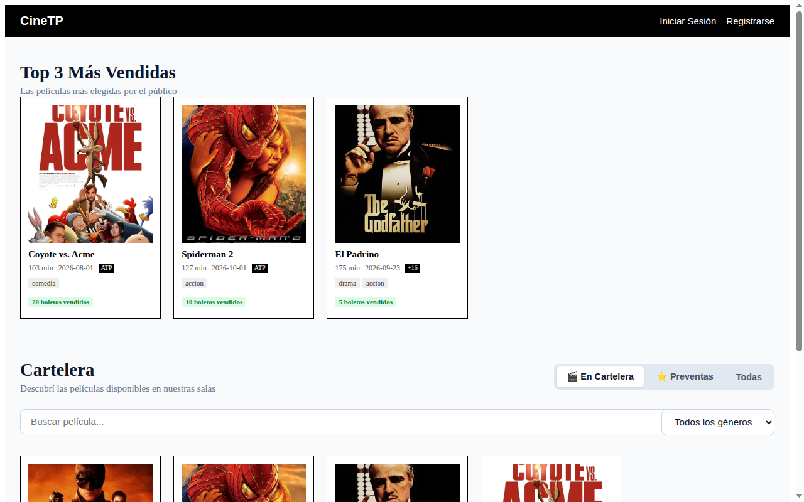
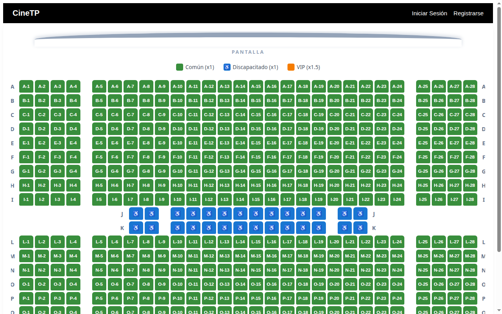
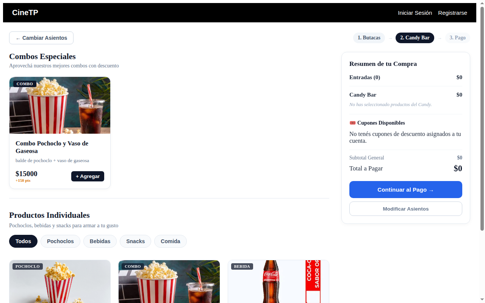
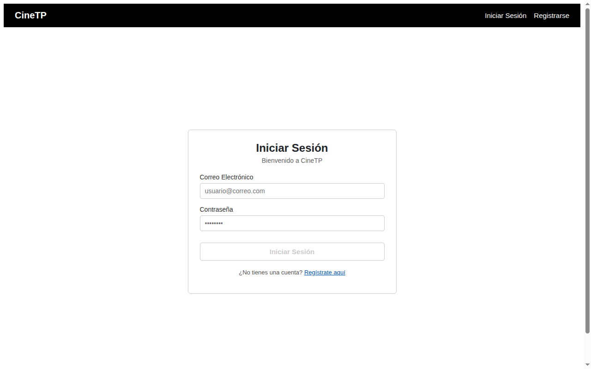
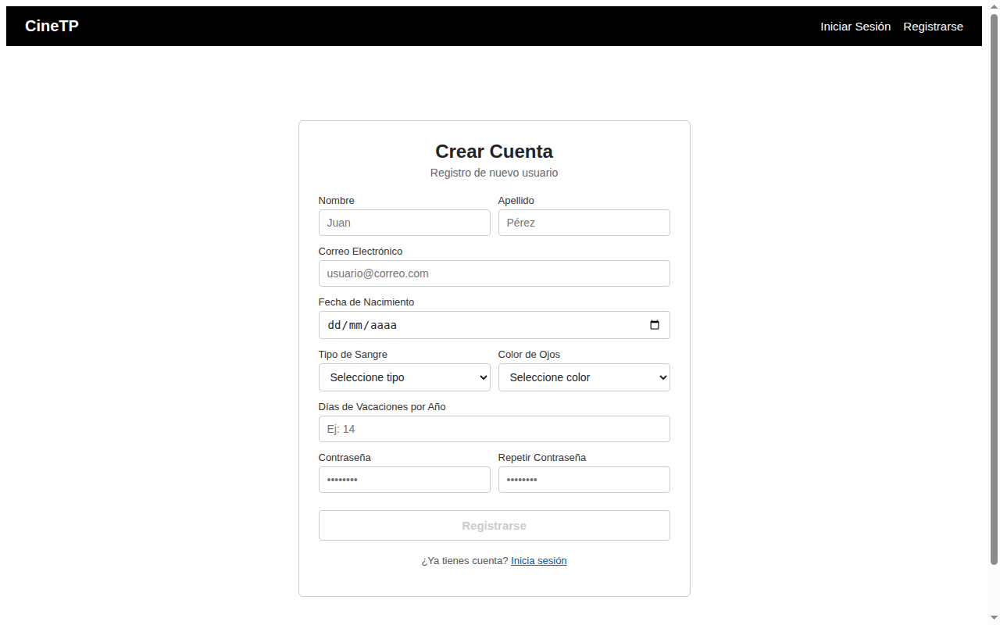

# CineTP · Sistema de Gestión y Venta de Cine Online

Aplicación web integral para la venta de entradas cinematográficas, selección interactiva de butacas en tiempo real, compra de productos de confitería (Candy Bar), canje de cupones de descuento, emisión de tickets con código QR y panel administrativo de control de cartelera, salas y auditoría.

- **Sitio publicado en producción:** [https://cinetp-ab899.web.app](https://cinetp-ab899.web.app)
- **Framework:** Angular 22 (Standalone Components & Signals)
- **Backend as a Service:** Supabase (PostgreSQL, Auth, Storage, RPC & Realtime WebSockets)
- **Hosting:** Firebase Hosting (Google Cloud Platform)

---

## Capturas de Pantalla en Localhost (`http://localhost:4200`)

### 1. Cartelera Principal y Catálogo (`/home`)
Filtros dinámicos por género y formato (2D/3D), buscador por título en tiempo real y sección destacada del Top 3 de películas más vendidas.


---

### 2. Mapa Interactivo de Sala y Selección de Butacas (`/sala`)
Matriz de 20 filas (A a T) distribuida en 3 bloques (4-20-4), filas J y K para personas con discapacidad y filas R, S y T VIP. Sincronización en vivo con WebSockets mediante Supabase Realtime para evitar doble compra de asientos.


---

### 3. Confitería y Cupones de Descuento (`/candy`)
Selección de combos, pochoclos, bebidas y golosinas con cálculo automático de totales, puntos acumulables y aplicación de cupones promocionales (20% primera compra, +50 años, etc.).


---

### 4. Módulo de Autenticación y Control de Acceso (`/login` y `/registro`)
Formularios reactivos con validaciones estrictas desacopladas, control de coincidencia de contraseñas y validación de fecha de nacimiento.



---

## Tecnologías Utilizadas

| Capa / Área | Tecnología | Propósito en el Sistema |
| :--- | :--- | :--- |
| **Frontend Framework** | **Angular 22** (`@angular/core`) | SPA con componentes Standalone (sin `NgModule`), control flow nativo (`@if`, `@for`), SSR/CSR. |
| **Gestión de Estado** | **Angular Signals** | Reactividad síncrona de grano fino mediante `signal()`, `computed()` y `effect()`. |
| **Lenguaje Base** | **TypeScript 6** | Tipado estricto en modelos de dominio, DTOs y validadores reactivos. |
| **Backend & Base de Datos** | **Supabase (PostgreSQL)** | Base relacional con claves foráneas, índices y funciones almacenadas PL/pgSQL. |
| **Seguridad de Datos** | **Row Level Security (RLS)** | Políticas de seguridad granulares por fila en PostgreSQL evaluando tokens JWT con `auth.uid()`. |
| **Autenticación** | **Supabase Auth (GoTrue)** | Gestión de usuarios, sesiones persistentes con tokens JWT y control de roles (`cliente`, `empleado`, `admin`). |
| **Tiempo Real** | **Supabase Realtime (WebSockets)** | Replicación instantánea de eventos `INSERT`/`UPDATE` sobre `asientos_funcion` sin requerir polling HTTP. |
| **Almacenamiento Multimedia** | **Supabase Storage** | Bucket `imagenes` para pósters de películas y fotos de artículos de confitería. |
| **Lector y Generador QR** | **`qrcode`** / **`jsqr`** | Generación de imágenes QR interactivas en tickets y decodificación por cámara web para personal del cine. |
| **Testing** | **Vitest** + **jsdom** | Suite de pruebas unitarias moderna y de rápida ejecución. |
| **Hosting & CI/CD** | **Firebase Hosting** | Despliegue estático de alto rendimiento con CDN global de Google Cloud. |

---

## Correr Localmente

### Pasos de instalación y puesta en marcha

1. **Ingresar a la carpeta del proyecto:**
   ```bash
   cd cineTP
   ```

2. **Instalar dependencias:**
   ```bash
   npm install
   ```

3. **Iniciar el servidor local:**
   ```bash
   ng serve
   ```
   *(También puedes usar `npm start`)*

4. **Acceder a la aplicación:**
   Abrir en el navegador web:
   ```text
   http://localhost:4200
   ```

---

### Cuentas de Prueba Preconfiguradas

Para probar los distintos roles del sistema en el entorno local o en producción:

| Rol | Correo Electrónico | Contraseña | Acceso / Funcionalidad |
| :--- | :--- | :--- | :--- |
| **Administrador** | `admin@cine.tp` | `admin123` | Control total del panel `/admin` (Películas, Funciones, Salas, Candy, Cupones, Empleados, Auditoría). |
| **Empleado** | `empleado1@cine.tp` | `empleado123` | Acceso a `/empleado/validar` con escáner QR mediante cámara web o código manual. |
| **Cliente** | `testjoaquin@cinetp.com` | `test123` | Flujo de compra completo, canje de cupones, acumulación de puntos y gestión de `/perfil`. |

---

## Cómo Actualizar el Deploy en Firebase Hosting

El proyecto se encuentra conectado a Firebase Hosting bajo el proyecto `cinetp-ab899`.

### 1. Requisitos iniciales (una sola vez por máquina)
Instalar Firebase CLI de forma global si aún no está instalado:
```bash
npm install -g firebase-tools
```

Iniciar sesión con tu cuenta de Google/Firebase:
```bash
firebase login
```

Verificar que el proyecto esté seleccionado (ejecutar desde la raíz del proyecto):
```bash
firebase projects:list
firebase use cinetp-ab899
```

---

### 2. Despliegue automatizado en producción

El script `deploy` de `package.json` compila la aplicación con optimizaciones de producción y publica los archivos en Firebase Hosting automáticamente:

```bash
npm run deploy
```

#### ¿Qué hace este comando internamente?
1. Ejecuta `ng build --configuration production`, empaquetando y minificando el código en `dist/cineTP/browser`.
2. Ejecuta el hook `postbuild` que copia `index.csr.html` a `index.html` para compatibilidad de SPA.
3. Ejecuta `firebase deploy --only hosting`, subiendo la carpeta de distribución a la infraestructura de Firebase.

---

### 3. Alternativa: compilar y desplegar manualmente por separado

Si deseas compilar primero para verificar que no haya errores de compilación antes de desplegar:

```bash
# Paso A: Compilar el bundle de producción
npm run build -- --configuration production

# Paso B: Desplegar solo los archivos estáticos generados
firebase deploy --only hosting
```

Al finalizar el despliegue, la consola mostrará la URL pública lista para usar:
```text
✔  Deploy complete!
Hosting URL: https://cinetp-ab899.web.app
```

---

## Estructura del Código Fuente

```text
cineTP/
├── docs/
│   └── screenshots/              # Capturas de pantalla de la aplicación
├── src/
│   ├── app/
│   │   ├── componentes/          # Vistas públicas, de cliente, empleado y panel admin
│   │   │   ├── admin/            # CRUDs administrativos (Películas, Funciones, Salas, etc.)
│   │   │   ├── candy/            # Tarjeta de producto y carrito de compras
│   │   │   ├── empleado/         # Validador QR con cámara web
│   │   │   ├── home/             # Landing page y Cartelera
│   │   │   ├── login/            # Formulario de inicio de sesión
│   │   │   ├── pago/             # Confirmación, generación QR y ticket
│   │   │   ├── pelicula/         # Tarjetas de films y cartelera
│   │   │   ├── perfil/           # Historial de entradas, puntos y cancelación
│   │   │   ├── registro/         # Formulario de registro de clientes
│   │   │   └── sala/             # Mapa interactivo de butacas
│   │   ├── directivas/           # Directivas de atributo (HoverZoom) y estructurales (Admin, Empleado)
│   │   ├── guards/               # authGuard y roleGuard funcionales
│   │   ├── models/               # Interfaces TypeScript (usuario, película, función, etc.)
│   │   ├── servicios/            # Servicios singleton comunicados con Supabase
│   │   └── validators/           # Validadores reactivos desacoplados
│   ├── environments/             # Configuración de URLs y claves públicas de Supabase
│   └── index.html                # Plantilla HTML raíz
├── angular.json                  # Configuración de Angular CLI y build
├── firebase.json                 # Configuración de hosting de Firebase
└── package.json                  # Dependencias y scripts del proyecto
```
